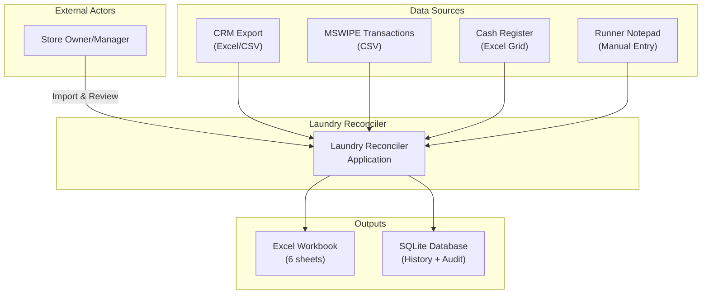
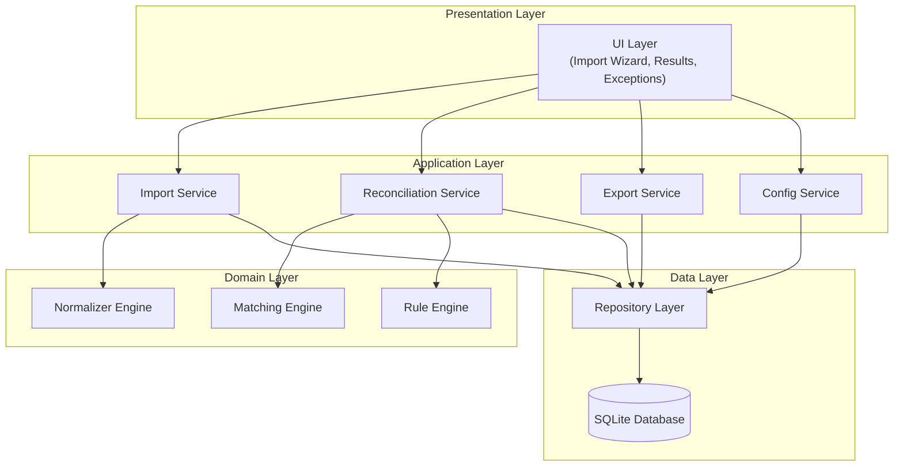
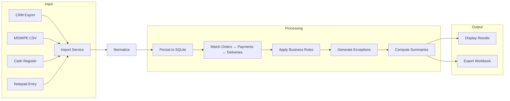
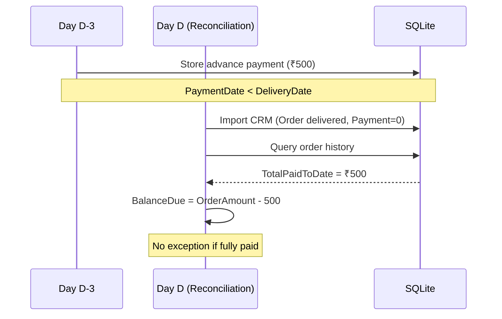
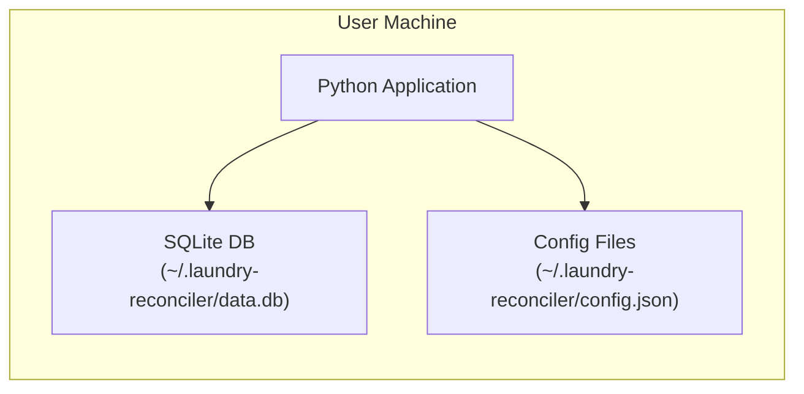

# System Architecture — Laundry Reconciler MVP

## 1. System Overview

The Laundry Reconciler is a local-first desktop application that automates daily reconciliation of laundry orders by importing data from multiple sources, matching orders with payments, and flagging exceptions for quick resolution.

### System Context Diagram



---

## 2. Component Architecture

### High-Level Component Diagram



### Component Responsibilities

| Component | Responsibility |
|-----------|----------------|
| **UI Layer** | Import wizard screens, results display, exception queue, daily summary |
| **Import Service** | File ingestion, column mapping, validation, data persistence |
| **Reconciliation Service** | Orchestrates matching and rule execution for a date |
| **Export Service** | Generates Excel workbook with 6 sheets |
| **Config Service** | Manages tolerances, mapping profiles, settings |
| **Normalizer Engine** | Date parsing, amount parsing, payment mode standardization |
| **Matching Engine** | Order-payment-delivery matching with confidence scoring |
| **Rule Engine** | Business rule execution, exception generation, severity classification |
| **Repository Layer** | Data access abstraction over SQLite |

---

## 3. Data Flow

### End-to-End Reconciliation Flow



### Cross-Date Processing

The system maintains history across dates to handle:
- **Advance payments**: Payment recorded days before delivery
- **Partial payments**: Multiple payments for same order over time
- **Order mini-ledger**: Running balance per order (OrderAmount - TotalPaidToDate)



---

## 4. Technology Stack

### Decision: Technology Choices

| Layer | Technology | Rationale |
|-------|------------|-----------|
| **Language** | Python 3.10+ | PRD requirement; rich ecosystem for data processing |
| **Data Store** | SQLite | ACID compliance, JSON columns, zero-config, widely available |
| **Excel Parsing** | pandas + openpyxl | Robust Excel/CSV handling, DataFrame operations |
| **Fuzzy Matching** | rapidfuzz | Fast fuzzy string matching (Levenshtein, token_set_ratio) |
| **Date Parsing** | python-dateutil | Handles multiple date formats robustly |
| **Excel Export** | xlsxwriter | Multi-sheet workbook generation with formatting |
| **OCR (optional)** | pytesseract | Notepad screenshot parsing (behind feature toggle) |

### Decision: SQLite over TinyDB

**Context**: Need to persist reconciliation history across dates, support complex queries for cross-date lookups.

**Options Considered**:
- SQLite: RDBMS with JSON support
- TinyDB: Document store
- LMDB/RocksDB: Key-value stores

**Decision**: SQLite

**Rationale**:
1. ACID compliance for data integrity during reconciliation
2. JSON column support (`json_extract()`) for flexible event storage
3. Rich query capabilities for cross-date payment lookups
4. Zero external dependencies; single-file database
5. Better performance for indexed queries on 500+ orders/day

---

## 5. Deployment Model

### Local-First Architecture



**Characteristics**:
- No server or network required
- All data stored locally
- Single-user desktop application
- Portable: database is a single file

### File System Layout

```
~/.laundry-reconciler/
├── data.db                 # SQLite database
├── config.json             # User settings, tolerances
├── mappings/               # Saved column mapping profiles
│   ├── crm-default.json
│   └── mswipe-default.json
├── exports/                # Generated workbooks
│   └── reconciliation-2025-11-29.xlsx
└── logs/                   # Application logs
    └── app.log
```

---

## 6. Security Considerations

| Concern | Design Decision |
|---------|-----------------|
| **Secrets** | No secrets required for MVP (local-only). Future: use environment variables or OS keychain. |
| **Data at Rest** | SQLite file on local disk; user responsible for disk encryption if needed. |
| **Sensitive Fields** | Customer mobile numbers stored but not displayed in exports unless required. |
| **Audit Trail** | Immutable audit log records all actions with timestamps. |

---

## 7. Extensibility Points

The architecture supports future enhancements:

| Extension Point | Mechanism |
|-----------------|-----------|
| **New data sources** | Implement `DataSourceParser` interface |
| **New matching strategies** | Add to matcher plugin chain |
| **New business rules** | Register rules with Rule Engine |
| **Runner direct entry** | Add mobile/web UI calling same services |
| **Cloud sync** | Replace SQLite with cloud-backed store |

---

## 8. Key Design Decisions Summary

| Decision | Choice | Key Rationale |
|----------|--------|---------------|
| Data Store | SQLite | ACID, JSON columns, zero-config |
| Matching | Exact → Fuzzy → Probabilistic | Per PRD §3.4 priority order |
| History | Cross-date persistence | Required for advance payment tracking |
| Rule Engine | Priority-based | Rules execute in defined order |
| Export | Single Excel workbook | 6 sheets per PRD §4.2 |
| Deployment | Local-first | No server, single-user, portable |
