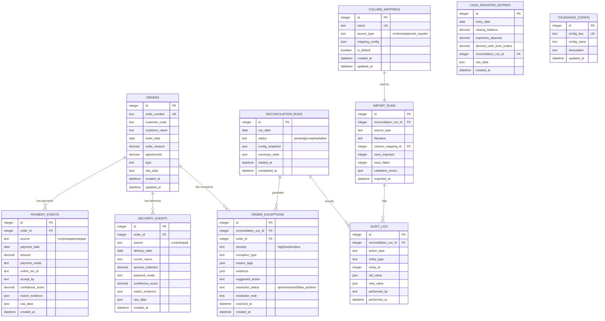

# Data Model Design — Laundry Reconciler MVP

## 1. Overview

This document defines the data persistence layer for the Laundry Reconciler. All data is stored in a local SQLite database with JSON columns for flexible document storage.

---

## 2. Entity-Relationship Diagram



---

## 3. Table Schemas

### 3.1 orders

Core table for CRM orders. Maps to CRM export columns.

| Column | Type | Nullable | Default | Description |
|--------|------|----------|---------|-------------|
| id | INTEGER | NOT NULL | AUTO | Primary key |
| order_number | TEXT | NOT NULL | - | Unique order identifier from CRM |
| customer_code | TEXT | NULL | - | Customer code |
| customer_name | TEXT | NOT NULL | - | Customer name (normalized) |
| customer_address | TEXT | NULL | - | Address |
| customer_mobile | TEXT | NULL | - | Mobile number |
| order_date | DATE | NOT NULL | - | Order creation date |
| order_amount | DECIMAL(10,2) | NOT NULL | 0 | Original order value |
| payment_received | DECIMAL(10,2) | NOT NULL | 0 | CRM payment field |
| adjustments | DECIMAL(10,2) | NOT NULL | 0 | Returns/reversals |
| balance | DECIMAL(10,2) | NOT NULL | 0 | CRM balance field |
| type | TEXT | NULL | 'Order' | Record type |
| raw_data | JSON | NULL | - | Original row as imported |
| created_at | DATETIME | NOT NULL | NOW | Record creation time |
| updated_at | DATETIME | NOT NULL | NOW | Last update time |

**Indexes**:
- `idx_orders_order_number` UNIQUE on `order_number`
- `idx_orders_order_date` on `order_date`
- `idx_orders_customer_name` on `customer_name`

---

### 3.2 payment_events

Unified payment stream from CRM, MSWIPE, and Notepad.

| Column | Type | Nullable | Default | Description |
|--------|------|----------|---------|-------------|
| id | INTEGER | NOT NULL | AUTO | Primary key |
| order_id | INTEGER | NULL | - | FK to orders (NULL if unmatched) |
| source | TEXT | NOT NULL | - | 'crm', 'mswipe', 'notepad' |
| payment_date | DATE | NOT NULL | - | Payment date |
| amount | DECIMAL(10,2) | NOT NULL | - | Payment amount |
| payment_mode | TEXT | NOT NULL | - | Normalized: Cash, GPay, Paytm, etc. |
| original_mode | TEXT | NULL | - | Original mode from source |
| online_txn_id | TEXT | NULL | - | Transaction ID if digital |
| accept_by | TEXT | NULL | - | Runner/Manager |
| payee_vpa | TEXT | NULL | - | UPI VPA (from MSWIPE) |
| mswipe_ref_ids | JSON | NULL | - | RR_NO, Stan_No, ARN, etc. |
| confidence_score | DECIMAL(3,2) | NULL | - | Match confidence 0.00-1.00 |
| match_evidence | JSON | NULL | - | Fields that matched |
| raw_data | JSON | NULL | - | Original row |
| created_at | DATETIME | NOT NULL | NOW | Record creation |

**Indexes**:
- `idx_payment_events_order_id` on `order_id`
- `idx_payment_events_date` on `payment_date`
- `idx_payment_events_amount` on `amount`
- `idx_payment_events_mode` on `payment_mode`

---

### 3.3 delivery_events

Delivery records from CRM and Notepad.

| Column | Type | Nullable | Default | Description |
|--------|------|----------|---------|-------------|
| id | INTEGER | NOT NULL | AUTO | Primary key |
| order_id | INTEGER | NULL | - | FK to orders |
| source | TEXT | NOT NULL | - | 'crm', 'notepad' |
| delivery_date | DATE | NOT NULL | - | Delivery date |
| customer_name | TEXT | NULL | - | Name from source |
| amount_collected | DECIMAL(10,2) | NULL | - | Amount if from notepad |
| payment_mode | TEXT | NULL | - | Mode if from notepad |
| runner_name | TEXT | NULL | - | Runner identifier |
| notes | TEXT | NULL | - | Free-form notes |
| confidence_score | DECIMAL(3,2) | NULL | - | Match confidence |
| match_evidence | JSON | NULL | - | Match explanation |
| raw_data | JSON | NULL | - | Original row |
| created_at | DATETIME | NOT NULL | NOW | Record creation |

**Indexes**:
- `idx_delivery_events_order_id` on `order_id`
- `idx_delivery_events_date` on `delivery_date`

---

### 3.4 reconciliation_runs

Date-scoped processing snapshots.

| Column | Type | Nullable | Default | Description |
|--------|------|----------|---------|-------------|
| id | INTEGER | NOT NULL | AUTO | Primary key |
| run_date | DATE | NOT NULL | - | Target reconciliation date |
| status | TEXT | NOT NULL | 'pending' | pending, complete, failed |
| config_snapshot | JSON | NULL | - | Tolerances used for this run |
| summary_stats | JSON | NULL | - | Aggregated results |
| started_at | DATETIME | NOT NULL | NOW | Run start time |
| completed_at | DATETIME | NULL | - | Run completion time |

**Summary Stats JSON Schema**:
```json
{
  "total_orders": 150,
  "matched_orders": 142,
  "exceptions_high": 3,
  "exceptions_medium": 5,
  "exceptions_low": 8,
  "total_gpay_crm": 15000.00,
  "total_gpay_mswipe": 14850.00,
  "total_cash_expected": 8500.00,
  "cash_register_derived": 8400.00,
  "cash_variance": 100.00
}
```

---

### 3.5 order_exceptions

Generated exceptions with severity and evidence.

| Column | Type | Nullable | Default | Description |
|--------|------|----------|---------|-------------|
| id | INTEGER | NOT NULL | AUTO | Primary key |
| reconciliation_run_id | INTEGER | NOT NULL | - | FK to runs |
| order_id | INTEGER | NULL | - | FK to orders (NULL for day-level) |
| severity | TEXT | NOT NULL | - | high, medium, low |
| exception_type | TEXT | NOT NULL | - | Exception category |
| reason_tags | JSON | NOT NULL | - | Array of reason codes |
| evidence | JSON | NULL | - | Source values |
| suggested_action | TEXT | NULL | - | Recommended fix |
| resolution_status | TEXT | NOT NULL | 'open' | open, resolved, false_positive |
| resolution_note | TEXT | NULL | - | User notes |
| resolved_at | DATETIME | NULL | - | Resolution time |
| created_at | DATETIME | NOT NULL | NOW | Creation time |

**Indexes**:
- `idx_exceptions_run_id` on `reconciliation_run_id`
- `idx_exceptions_severity` on `severity`
- `idx_exceptions_status` on `resolution_status`

---

### 3.6 column_mappings

Saved column mapping profiles.

| Column | Type | Nullable | Default | Description |
|--------|------|----------|---------|-------------|
| id | INTEGER | NOT NULL | AUTO | Primary key |
| name | TEXT | NOT NULL | - | Profile name (unique) |
| source_type | TEXT | NOT NULL | - | crm, mswipe, cash_register |
| mapping_config | JSON | NOT NULL | - | Column name → field mapping |
| is_default | BOOLEAN | NOT NULL | FALSE | Default for source type |
| created_at | DATETIME | NOT NULL | NOW | Creation time |
| updated_at | DATETIME | NOT NULL | NOW | Last update |

**Mapping Config JSON Schema**:
```json
{
  "order_number": "Order Number",
  "order_date": "Order Date",
  "customer_name": "Customer Name",
  "payment_received": "Payment Received",
  "payment_mode": "Payment Mode",
  "payment_date": "Payment Date"
}
```

---

### 3.7 cash_register_entries

Daily cash register closing balances.

| Column | Type | Nullable | Default | Description |
|--------|------|----------|---------|-------------|
| id | INTEGER | NOT NULL | AUTO | Primary key |
| entry_date | DATE | NOT NULL | - | Calendar date |
| closing_balance | DECIMAL(10,2) | NULL | - | C_d from register |
| prior_closing_balance | DECIMAL(10,2) | NULL | - | C_(d-1) |
| expenses_deposits | DECIMAL(10,2) | NULL | 0 | E_d manual input |
| derived_cash_from_orders | DECIMAL(10,2) | NULL | - | Computed signal |
| reconciliation_run_id | INTEGER | NULL | - | FK to runs |
| validation_status | TEXT | NULL | 'valid' | valid, partial, missing |
| raw_data | JSON | NULL | - | Cell values |
| created_at | DATETIME | NOT NULL | NOW | Creation time |

---

### 3.8 audit_log

Immutable log of all actions.

| Column | Type | Nullable | Default | Description |
|--------|------|----------|---------|-------------|
| id | INTEGER | NOT NULL | AUTO | Primary key |
| reconciliation_run_id | INTEGER | NULL | - | FK to runs |
| action_type | TEXT | NOT NULL | - | import, match, override, resolve |
| entity_type | TEXT | NOT NULL | - | order, payment, exception |
| entity_id | INTEGER | NULL | - | Target entity ID |
| old_value | JSON | NULL | - | Previous state |
| new_value | JSON | NULL | - | New state |
| performed_by | TEXT | NULL | 'system' | User or system |
| performed_at | DATETIME | NOT NULL | NOW | Action timestamp |

---

### 3.9 tolerance_config

Application settings.

| Column | Type | Nullable | Default | Description |
|--------|------|----------|---------|-------------|
| id | INTEGER | NOT NULL | AUTO | Primary key |
| config_key | TEXT | NOT NULL | - | Setting name (unique) |
| config_value | TEXT | NOT NULL | - | Setting value |
| description | TEXT | NULL | - | Help text |
| updated_at | DATETIME | NOT NULL | NOW | Last update |

**Default Tolerances** (per PRD §3.2):
| Key | Default Value |
|-----|---------------|
| amount_match_tolerance_inr | 2 |
| daily_total_tolerance_inr | 10 |
| daily_total_tolerance_percent | 0.5 |
| mswipe_time_match_window_minutes | 180 |
| fuzzy_name_min_score | 0.82 |
| fuzzy_date_proximity_days | 3 |
| cash_variance_tolerance_inr | 100 |
| cash_variance_tolerance_percent | 1.0 |
| credit_tolerance_inr | 1 |

---

## 4. Sample Data Mapping

### CRM Export → orders + payment_events

| CRM Column | Target Table | Target Column |
|------------|--------------|---------------|
| Order Number | orders | order_number |
| Order Date | orders | order_date |
| Customer Name | orders | customer_name |
| Customer Code | orders | customer_code |
| Payment Received | orders | payment_received |
| Adjustments | orders | adjustments |
| Balance | orders | balance |
| Type | orders | type |
| Payment Date | payment_events | payment_date |
| Payment Mode | payment_events | payment_mode |
| Online TransactionID | payment_events | online_txn_id |
| Accept By | payment_events | accept_by |

### MSWIPE Export → payment_events

| MSWIPE Column | Target Column |
|---------------|---------------|
| PaymentDate (fallback: TxnDate) | payment_date |
| FinalPayment (fallback: NetAmt, TxnAmt) | amount |
| Interchange | original_mode |
| PayeeVPA | payee_vpa |
| RR_NO, Stan_No, Mswipe_Ref_No, ARN | mswipe_ref_ids (JSON) |

### Cash Register → cash_register_entries

| Grid Cell | Target Column |
|-----------|---------------|
| Row[day], Col[month] | closing_balance |
| Previous cell (with lookback) | prior_closing_balance |

---

## 5. Migration Strategy

### Initial Setup

```sql
-- Create all tables on first run
CREATE TABLE IF NOT EXISTS orders (...);
CREATE TABLE IF NOT EXISTS payment_events (...);
-- etc.

-- Insert default tolerances
INSERT INTO tolerance_config (config_key, config_value, description)
VALUES ('amount_match_tolerance_inr', '2', 'Order-level amount match tolerance');
-- etc.
```

### Version Control

Store schema version in `tolerance_config`:
```sql
INSERT INTO tolerance_config (config_key, config_value) 
VALUES ('schema_version', '1.0.0');
```

On startup, check version and run incremental migrations if needed.
