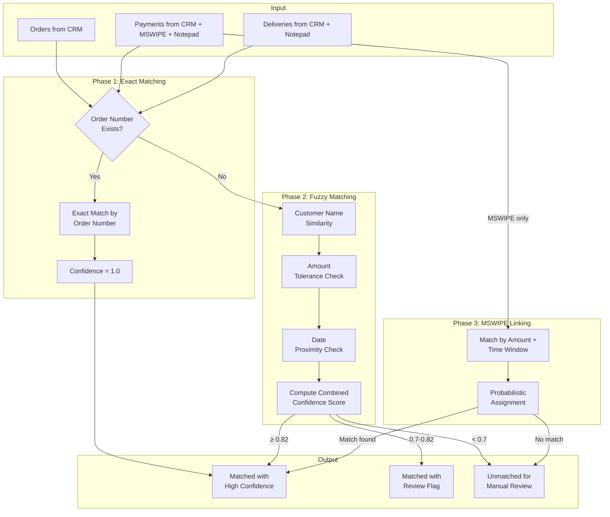
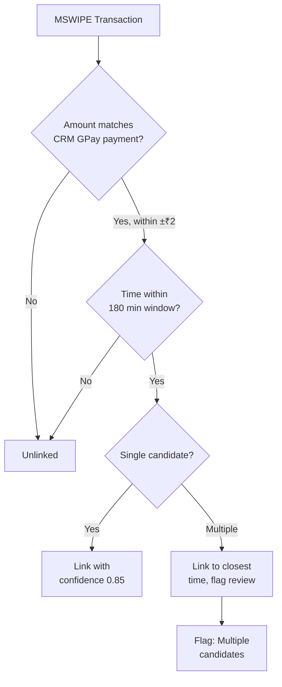

# Matching Algorithm Design — Laundry Reconciler MVP

## 1. Overview

The Matching Engine is responsible for linking orders to payments and deliveries across multiple data sources. It uses a priority-based strategy progressing from exact matches to fuzzy/probabilistic matches.

---

## 2. Matching Strategy Flowchart



---

## 3. Matching Priority Order

Per PRD §3.4, matching follows this priority:

| Priority | Strategy | Confidence | Description |
|----------|----------|------------|-------------|
| 1 | Exact Order Number | 1.0 | Order number in CRM matches notepad entry |
| 2 | Fuzzy Multi-Field | 0.0-1.0 | Name + amount + date combination |
| 3 | MSWIPE Probabilistic | 0.0-0.9 | Amount + time window only |

---

## 4. Exact Matching

### 4.1 Order Number Match (CRM ↔ Notepad)

```python
def exact_match_by_order_number(
    order: Order,
    event: PaymentEvent | DeliveryEvent
) -> Optional[MatchResult]:
    """
    Exact match when order numbers match exactly.
    
    Normalization before comparison:
    - Trim whitespace
    - Uppercase
    - Remove leading zeros
    """
    if not event.order_number:
        return None
    
    order_normalized = normalize_order_number(order.order_number)
    event_normalized = normalize_order_number(event.order_number)
    
    if order_normalized == event_normalized:
        return MatchResult(
            source_id=event.id,
            matched_order_id=order.id,
            confidence_score=1.0,
            match_evidence={
                "order_number": order.order_number,
                "match_type": "exact"
            },
            requires_review=False
        )
    return None
```

---

## 5. Fuzzy Matching

### 5.1 Customer Name Similarity

Using `rapidfuzz` for string similarity:

```python
from rapidfuzz import fuzz

def compute_name_similarity(name1: str, name2: str) -> float:
    """
    Compute name similarity score.
    
    Uses token_set_ratio to handle:
    - Word order variations ("John Doe" vs "Doe John")
    - Partial names ("J. Doe" vs "John Doe")
    - Hindi/English variations
    """
    n1 = normalize_customer_name(name1)
    n2 = normalize_customer_name(name2)
    
    # token_set_ratio is more forgiving with word order
    return fuzz.token_set_ratio(n1, n2) / 100.0
```

**Threshold**: 0.82 (PRD §3.2)

---

### 5.2 Amount Tolerance

```python
from decimal import Decimal

def amounts_match(
    amount1: Decimal,
    amount2: Decimal,
    tolerance_inr: Decimal = Decimal('2')
) -> tuple[bool, float]:
    """
    Check if amounts match within tolerance.
    
    Returns:
        (is_match, similarity_score)
    """
    diff = abs(amount1 - amount2)
    
    if diff <= tolerance_inr:
        # Score based on how close (0 diff = 1.0, at tolerance = 0.9)
        score = 1.0 - (float(diff) / float(tolerance_inr)) * 0.1
        return True, max(0.9, score)
    
    # Partial score for near misses
    if diff <= tolerance_inr * 5:
        score = 0.5 - (float(diff) / float(tolerance_inr * 10))
        return False, max(0.0, score)
    
    return False, 0.0
```

---

### 5.3 Date Proximity

```python
from datetime import date, timedelta

def compute_date_proximity_score(
    date1: date,
    date2: date,
    max_days: int = 3
) -> float:
    """
    Score based on date proximity.
    
    - Same day: 1.0
    - 1 day apart: 0.9
    - 2 days apart: 0.7
    - 3 days apart: 0.5
    - > 3 days: 0.0
    """
    diff = abs((date1 - date2).days)
    
    if diff == 0:
        return 1.0
    elif diff == 1:
        return 0.9
    elif diff == 2:
        return 0.7
    elif diff <= max_days:
        return 0.5
    else:
        return 0.0
```

---

### 5.4 Combined Confidence Score

```python
def compute_fuzzy_match_confidence(
    name_score: float,
    amount_match: bool,
    amount_score: float,
    date_score: float,
    has_runner_hint: bool = False
) -> float:
    """
    Combine individual scores into overall confidence.
    
    Weights:
    - Name similarity: 40%
    - Amount match: 35%
    - Date proximity: 20%
    - Runner/marked-by hint: 5% bonus
    
    Requirements:
    - Amount MUST match (within tolerance) for score > 0.5
    - Name score must be >= 0.82 for auto-match
    """
    if not amount_match:
        # Cap at 0.5 if amount doesn't match
        return min(0.5, name_score * 0.4 + date_score * 0.2)
    
    base_score = (
        name_score * 0.40 +
        amount_score * 0.35 +
        date_score * 0.20
    )
    
    if has_runner_hint:
        base_score += 0.05
    
    return min(1.0, base_score)
```

### 5.5 Match Decision Thresholds

| Confidence Range | Decision | Action |
|------------------|----------|--------|
| ≥ 0.82 | Auto-match | Link and mark as matched |
| 0.70 - 0.82 | Review required | Link but flag for review |
| < 0.70 | No match | Leave unmatched |

---

## 6. MSWIPE Transaction Linking

MSWIPE transactions lack order identifiers, so linking is probabilistic.

### 6.1 Linking Strategy



### 6.2 Linking Algorithm

```python
from datetime import datetime, timedelta

def link_mswipe_to_crm(
    mswipe_txn: PaymentEvent,
    crm_gpay_payments: list[PaymentEvent],
    config: MatchingConfig
) -> Optional[MatchResult]:
    """
    Link MSWIPE transaction to CRM GPay payment.
    
    Criteria:
    1. Amount within tolerance (default ±₹2)
    2. Transaction time within window (default 180 min)
    3. CRM payment mode is GPay/UPI
    """
    candidates = []
    
    for crm in crm_gpay_payments:
        if crm.payment_mode not in ('GPay', 'Google Pay', 'UPI'):
            continue
        
        # Amount check
        amount_diff = abs(mswipe_txn.amount - crm.amount)
        if amount_diff > config.amount_tolerance_inr:
            continue
        
        # Time check (if both have timestamps)
        if mswipe_txn.timestamp and crm.timestamp:
            time_diff = abs((mswipe_txn.timestamp - crm.timestamp).total_seconds())
            if time_diff > config.mswipe_time_window_minutes * 60:
                continue
            time_score = 1.0 - (time_diff / (config.mswipe_time_window_minutes * 60 * 2))
        else:
            # Date-only comparison
            if mswipe_txn.payment_date != crm.payment_date:
                continue
            time_score = 0.8
        
        candidates.append((crm, time_score))
    
    if not candidates:
        return None
    
    if len(candidates) == 1:
        crm, time_score = candidates[0]
        return MatchResult(
            source_id=mswipe_txn.id,
            matched_order_id=crm.order_id,
            confidence_score=0.85,
            match_evidence={
                "amount": str(mswipe_txn.amount),
                "match_type": "mswipe_amount_time"
            },
            requires_review=False
        )
    
    # Multiple candidates: pick closest time, flag for review
    candidates.sort(key=lambda x: x[1], reverse=True)
    crm, time_score = candidates[0]
    
    return MatchResult(
        source_id=mswipe_txn.id,
        matched_order_id=crm.order_id,
        confidence_score=0.7,
        match_evidence={
            "amount": str(mswipe_txn.amount),
            "match_type": "mswipe_probabilistic",
            "candidates_count": len(candidates)
        },
        requires_review=True
    )
```

---

## 7. Edge Cases

### 7.1 Orders with Multiple Payment Events

```python
def handle_multi_payment_order(
    order: Order,
    payments: list[PaymentEvent]
) -> list[MatchResult]:
    """
    Handle orders with multiple payments (advance + delivery).
    
    Allow multiple payments to link to same order.
    Track running balance.
    """
    results = []
    total_linked = Decimal('0')
    
    for payment in sorted(payments, key=lambda p: p.payment_date):
        match = match_payment_to_order(order, payment)
        if match:
            results.append(match)
            total_linked += payment.amount
    
    # Validate: total shouldn't exceed order amount (with tolerance)
    if total_linked > order.order_amount + Decimal('10'):
        for result in results:
            result.requires_review = True
            result.match_evidence["warning"] = "total_exceeds_order"
    
    return results
```

### 7.2 Advance Payments (Payment Before Delivery)

```python
def is_advance_payment(
    payment: PaymentEvent,
    order: Order
) -> bool:
    """Check if payment is an advance (before delivery)."""
    if not order.delivery_date:
        return True  # No delivery yet
    return payment.payment_date < order.delivery_date
```

### 7.3 Fuzzy Name Matching: Hindi/English Variations

Common patterns to handle:
- "Ram" ↔ "Raam"
- "Sharma" ↔ "Sarma"
- "Singh" ↔ "Sinh"
- Transliteration variations

```python
def normalize_for_hindi_english(name: str) -> str:
    """
    Normalize Hindi-English transliteration variations.
    """
    replacements = {
        'aa': 'a',
        'ee': 'i',
        'oo': 'u',
        'sh': 's',
        'th': 't',
        'ph': 'f',
    }
    name = name.lower()
    for old, new in replacements.items():
        name = name.replace(old, new)
    return name
```

### 7.4 Duplicate Notepad Entries

```python
def detect_duplicate_notepad(
    entries: list[DeliveryEvent]
) -> list[tuple[DeliveryEvent, DeliveryEvent]]:
    """
    Detect potential duplicate notepad entries.
    
    Criteria:
    - Same order number, OR
    - Same customer name + same amount + same date
    """
    duplicates = []
    
    # Check by order number
    by_order = {}
    for entry in entries:
        if entry.order_number:
            key = entry.order_number
            if key in by_order:
                duplicates.append((by_order[key], entry))
            else:
                by_order[key] = entry
    
    # Check by name + amount + date
    by_signature = {}
    for entry in entries:
        if not entry.order_number:
            key = (
                normalize_customer_name(entry.customer_name),
                entry.amount_collected,
                entry.delivery_date
            )
            if key in by_signature:
                duplicates.append((by_signature[key], entry))
            else:
                by_signature[key] = entry
    
    return duplicates
```

---

## 8. Confidence Scoring Summary

| Match Type | Base Confidence | Modifiers |
|------------|-----------------|-----------|
| Exact order number | 1.00 | None |
| Fuzzy (name ≥ 0.82, amount match, same day) | 0.90 | +0.05 runner hint |
| Fuzzy (name ≥ 0.82, amount match, ±1 day) | 0.85 | +0.05 runner hint |
| Fuzzy (name ≥ 0.82, amount match, ±2-3 days) | 0.75 | +0.05 runner hint |
| MSWIPE (single candidate) | 0.85 | None |
| MSWIPE (multiple candidates) | 0.70 | Requires review |
| Fuzzy (name < 0.82) | 0.60 max | Requires review |

---

## 9. Match Evidence Structure

Every match includes evidence for auditability:

```json
{
  "match_type": "fuzzy",
  "order_number_matched": false,
  "name_similarity": 0.91,
  "amount_matched": true,
  "amount_diff": "1.00",
  "date_proximity_days": 0,
  "runner_hint": "Raju",
  "computed_confidence": 0.92
}
```
