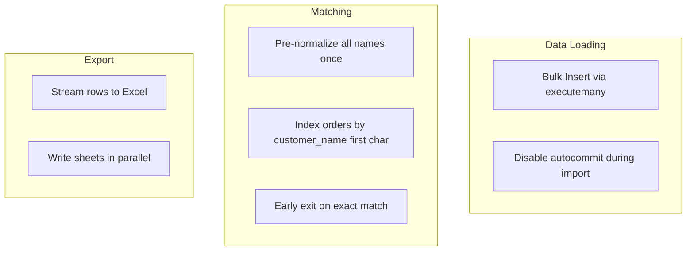
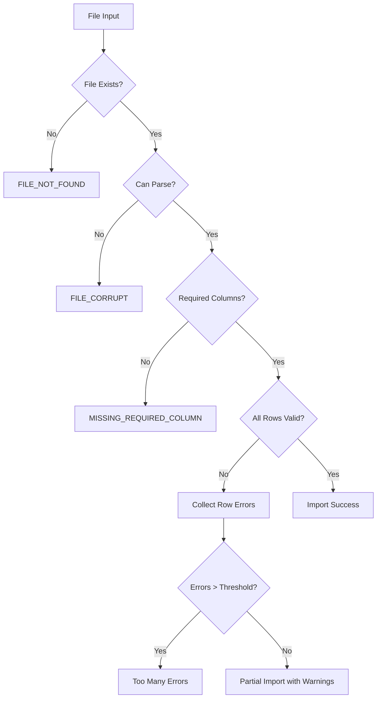

# Non-Functional Requirements Design — Laundry Reconciler MVP

## 1. Overview

This document addresses the non-functional requirements from PRD §5.2 and outlines design decisions for performance, reliability, auditability, and testability.

---

## 2. Performance Design

### 2.1 Requirements (PRD §5.2)
- Handle at least **500 orders/day**
- Complete reconciliation within **30 seconds** on typical laptop

### 2.2 Design Decisions

| Aspect | Decision | Rationale |
|--------|----------|-----------|
| **Batch Processing** | Load all data for run date into memory | 500 orders × ~1KB = ~500KB fits easily in memory |
| **SQLite Indexes** | Index on `order_date`, `payment_date`, `order_number` | Fast date-scoped queries |
| **Fuzzy Matching** | Use `rapidfuzz` with early termination | Optimized C implementation, stops at threshold |
| **Caching** | Cache normalized names during matching | Avoid repeated normalization |

### 2.3 Performance Benchmarks

```python
# Target performance metrics
PERFORMANCE_TARGETS = {
    "import_crm_500_rows": 5.0,      # 5 seconds max
    "import_mswipe_100_rows": 2.0,   # 2 seconds max
    "matching_500_orders": 10.0,      # 10 seconds max
    "rule_execution": 5.0,            # 5 seconds max
    "export_workbook": 5.0,           # 5 seconds max
    "total_reconciliation": 30.0      # 30 seconds max
}
```

### 2.4 Optimization Strategies



---

## 3. Reliability Design

### 3.1 Requirements (PRD §5.2)
- Clear error messages for:
  - Missing columns
  - Unreadable Excel sheets
  - Invalid dates
  - Unmapped payment modes

### 3.2 Error Categories and Messages

| Category | Error Code | User Message | Action |
|----------|------------|--------------|--------|
| **File Errors** | `FILE_NOT_FOUND` | "File not found: {path}" | Check file path |
| | `FILE_CORRUPT` | "Cannot read file: {path}. The file may be corrupt." | Try different file |
| | `UNSUPPORTED_FORMAT` | "Unsupported file format. Please use .xlsx, .xls, or .csv" | Convert file |
| **Column Errors** | `MISSING_REQUIRED_COLUMN` | "Required column '{column}' not found. Please map it." | Map column |
| | `COLUMN_TYPE_MISMATCH` | "Column '{column}' contains invalid data at row {row}" | Fix data |
| **Data Errors** | `INVALID_DATE` | "Invalid date '{value}' at row {row}. Expected format: DD-MMM-YYYY" | Fix date |
| | `INVALID_AMOUNT` | "Invalid amount '{value}' at row {row}. Expected a number." | Fix amount |
| | `UNMAPPED_MODE` | "Unknown payment mode '{mode}' at row {row}" | Add to mapping |
| **System Errors** | `DATABASE_ERROR` | "Database error. Please restart the application." | Restart app |

### 3.3 Validation Pipeline



### 3.4 Error Recovery

```python
class ImportService:
    def import_with_recovery(self, file_path: Path, mapping: ColumnMapping) -> ImportResult:
        """
        Import with graceful error handling.
        
        Strategy:
        1. Validate entire file first
        2. Report all validation errors at once
        3. Allow partial import if <10% rows have errors
        4. Skip bad rows, log details
        """
        errors = self.validate_file(file_path, mapping)
        
        if len(errors) > len(rows) * 0.1:
            raise TooManyErrorsException(errors)
        
        # Import valid rows, skip invalid
        for row in rows:
            try:
                self.import_row(row)
            except ValidationError as e:
                self.log_error(row, e)
                continue
        
        return ImportResult(
            rows_imported=success_count,
            rows_failed=len(errors),
            validation_errors=errors
        )
```

---

## 4. Auditability Design

### 4.1 Requirements (PRD §5.2)
- Log every import, match decision, and manual override

### 4.2 Audit Log Schema

```sql
CREATE TABLE audit_log (
    id INTEGER PRIMARY KEY,
    reconciliation_run_id INTEGER,
    action_type TEXT NOT NULL,
    entity_type TEXT NOT NULL,
    entity_id INTEGER,
    old_value JSON,
    new_value JSON,
    performed_by TEXT DEFAULT 'system',
    performed_at DATETIME DEFAULT CURRENT_TIMESTAMP
);

CREATE INDEX idx_audit_log_run ON audit_log(reconciliation_run_id);
CREATE INDEX idx_audit_log_action ON audit_log(action_type);
CREATE INDEX idx_audit_log_entity ON audit_log(entity_type, entity_id);
```

### 4.3 Audit Action Types

| Action Type | Entity Type | Description |
|-------------|-------------|-------------|
| `IMPORT` | order, payment, delivery | Record imported |
| `MATCH` | order, payment | Match created/updated |
| `MANUAL_LINK` | order, delivery | User linked notepad to order |
| `EXCEPTION_CREATE` | exception | Exception generated |
| `EXCEPTION_RESOLVE` | exception | Exception marked resolved |
| `EXCEPTION_FALSE_POSITIVE` | exception | Exception marked false positive |
| `CONFIG_CHANGE` | tolerance | Tolerance value changed |
| `MAPPING_SAVE` | column_mapping | Column mapping saved |

### 4.4 Audit Logging Implementation

```python
class AuditLogger:
    def log(
        self,
        action_type: str,
        entity_type: str,
        entity_id: int = None,
        old_value: dict = None,
        new_value: dict = None,
        run_id: int = None
    ) -> None:
        """Log an auditable action."""
        self.repo.insert({
            "reconciliation_run_id": run_id,
            "action_type": action_type,
            "entity_type": entity_type,
            "entity_id": entity_id,
            "old_value": json.dumps(old_value) if old_value else None,
            "new_value": json.dumps(new_value) if new_value else None,
            "performed_by": self.current_user,
            "performed_at": datetime.now()
        })
    
    def log_match(self, order_id: int, payment_id: int, confidence: float, run_id: int):
        self.log(
            action_type="MATCH",
            entity_type="order",
            entity_id=order_id,
            new_value={
                "payment_id": payment_id,
                "confidence": confidence
            },
            run_id=run_id
        )
    
    def log_exception_resolve(self, exception_id: int, resolution: str, note: str, run_id: int):
        exception = self.exception_repo.get_by_id(exception_id)
        self.log(
            action_type=f"EXCEPTION_{resolution.upper()}",
            entity_type="exception",
            entity_id=exception_id,
            old_value={"status": exception.resolution_status},
            new_value={"status": resolution, "note": note},
            run_id=run_id
        )
```

### 4.5 Audit Report (Export Sheet)

The `Audit_Log` sheet in the export workbook contains:

| Column | Description |
|--------|-------------|
| Timestamp | When action occurred |
| Action | Action type |
| Entity | Entity affected (Order #, Payment ID, etc.) |
| User | Who performed action |
| Details | JSON summary of changes |

---

## 5. Security Design

### 5.1 Requirements (PRD §5.2)
- Secrets should be handled in a vault and never committed to codebase

### 5.2 Design Decisions

| Concern | Decision |
|---------|----------|
| **Secrets** | MVP has no external secrets (local-only). Future: environment variables |
| **Sensitive Data** | Customer mobile not exported by default. Configurable. |
| **Data at Rest** | Local SQLite file. User responsibility for disk encryption. |
| **No Authentication** | Single-user local app. No login required for MVP. |

### 5.3 Data Classification

| Data Type | Classification | Handling |
|-----------|---------------|----------|
| Order numbers | Business data | Store and export |
| Customer names | PII | Store, export |
| Customer mobile | PII - Sensitive | Store, exclude from export by default |
| Customer address | PII | Store, exclude from export by default |
| Payment amounts | Business data | Store and export |
| Transaction IDs | Business data | Store and export |

---

## 6. Testing Strategy

### 6.1 Test Pyramid

```
                    ┌─────────┐
                    │   E2E   │  2-3 critical paths
                   ┌┴─────────┴┐
                   │Integration│  Per module
                  ┌┴───────────┴┐
                  │  Unit Tests  │  All business logic
                  └──────────────┘
```

### 6.2 Unit Tests

| Module | Test Focus | Coverage Target |
|--------|------------|-----------------|
| `normalizer.py` | Date parsing, amount parsing, mode normalization | 100% |
| `matcher.py` | Exact match, fuzzy match, confidence scoring | 100% |
| `rules.py` | Each rule in isolation | 100% |
| `repositories/` | CRUD operations | 80% |

**Example Unit Tests:**

```python
# tests/test_normalizer.py

class TestDateParser:
    def test_parse_dd_mmm_yyyy(self):
        assert parse_date("01-Nov-2025") == date(2025, 11, 1)
    
    def test_parse_dd_mm_yyyy(self):
        assert parse_date("01/11/2025") == date(2025, 11, 1)
    
    def test_parse_iso(self):
        assert parse_date("2025-11-01") == date(2025, 11, 1)
    
    def test_parse_excel_serial(self):
        assert parse_date(45962) == date(2025, 11, 1)
    
    def test_invalid_date_returns_none(self):
        assert parse_date("invalid") is None

class TestAmountParser:
    def test_parse_plain_number(self):
        assert parse_amount("500") == Decimal("500")
    
    def test_parse_with_commas(self):
        assert parse_amount("1,000.50") == Decimal("1000.50")
    
    def test_parse_with_currency(self):
        assert parse_amount("₹500") == Decimal("500")
    
    def test_parse_negative(self):
        assert parse_amount("-100") == Decimal("-100")
```

### 6.3 Integration Tests

| Test | Scope | Description |
|------|-------|-------------|
| Import → Match | Multi-module | Import CRM + Notepad, run matching, verify links |
| Match → Rules | Multi-module | Create matches, run rules, verify exceptions |
| Full Reconciliation | Service | Run complete reconciliation, verify all outputs |
| Export Workbook | Service | Generate export, verify all 6 sheets |

**Example Integration Test:**

```python
# tests/integration/test_reconciliation_flow.py

class TestReconciliationFlow:
    def test_full_reconciliation_with_sample_data(self, sample_db):
        # Setup
        import_service = ImportService(sample_db)
        recon_service = ReconciliationService(sample_db)
        
        # Import test data
        import_service.import_crm_export(SAMPLE_CRM_FILE, CRM_MAPPING, run_id=1)
        import_service.import_mswipe_transactions(SAMPLE_MSWIPE_FILE, MSWIPE_MAPPING, run_id=1)
        
        # Execute reconciliation
        result = recon_service.execute_reconciliation(run_id=1)
        
        # Verify
        assert result.status == "complete"
        assert result.matched_orders > 0
        assert all(e.severity in ("high", "medium", "low") for e in result.exceptions)
```

### 6.4 Test Data

Maintain test fixtures based on sample data:

```
tests/fixtures/
├── crm_sample_10_orders.xlsx
├── crm_sample_with_errors.xlsx
├── mswipe_sample_20_txns.csv
├── cash_register_2025.xlsx
└── expected_results/
    ├── matched_orders.json
    └── expected_exceptions.json
```

### 6.5 Testing Tolerances

Test edge cases around tolerance boundaries:

```python
class TestAmountTolerance:
    @pytest.mark.parametrize("amount1,amount2,expected", [
        (Decimal("100"), Decimal("100"), True),   # Exact match
        (Decimal("100"), Decimal("101"), True),   # Within ₹2
        (Decimal("100"), Decimal("102"), True),   # At boundary
        (Decimal("100"), Decimal("103"), False),  # Over tolerance
    ])
    def test_amount_matching(self, amount1, amount2, expected):
        assert amounts_match(amount1, amount2, Decimal("2"))[0] == expected
```

---

## 7. Logging Framework

### 7.1 Log Levels

| Level | Use For |
|-------|---------|
| DEBUG | Detailed matching decisions, SQL queries |
| INFO | Import summaries, reconciliation status |
| WARNING | Missing optional data, skipped rows |
| ERROR | Validation failures, exceptions |

### 7.2 Log Format

```python
import logging

logging.basicConfig(
    format='%(asctime)s | %(levelname)s | %(name)s | %(message)s',
    level=logging.INFO,
    handlers=[
        logging.FileHandler('~/.laundry-reconciler/logs/app.log'),
        logging.StreamHandler()
    ]
)
```

### 7.3 Structured Logging for Key Events

```python
logger.info("Reconciliation started", extra={
    "run_id": run.id,
    "run_date": str(run.run_date),
    "config": run.config_snapshot
})

logger.info("Matching complete", extra={
    "run_id": run.id,
    "orders_matched": 142,
    "unmatched_notepad": 3,
    "unmatched_mswipe": 5
})
```

---

## 8. Acceptance Criteria Verification (PRD §5.3)

| Criterion | Design Support |
|-----------|----------------|
| Import all four inputs + map columns | Import Service with mapping profiles |
| Run reconciliation for selected date | ReconciliationService.execute_reconciliation() |
| Generate reconciled table with status | Export sheet: Reconciled_Orders |
| Generate exceptions with reasons + actions | ORDER_EXCEPTIONS table, Export sheet |
| Flag "Delivered not marked in CRM" | Rule R01: DELIVERED_NOT_MARKED_CRM |
| Flag "Possible payment not received" | Rule R05: GPAY_NO_MSWIPE_MATCH |
| Cash variance comparison | Rule R06: CASH_VARIANCE |
| Export workbook with defined sheets | ExportService.export_reconciliation() |
