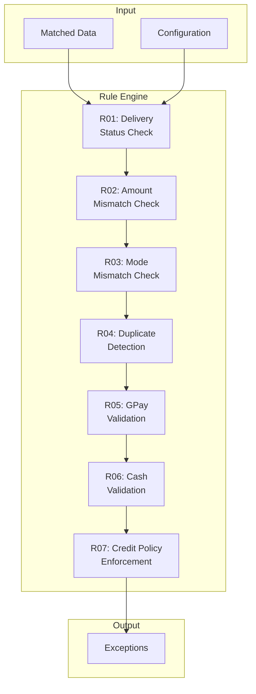

# Reconciliation Rules Design — Laundry Reconciler MVP

## 1. Rule Engine Architecture



Rules execute in priority order. Each rule produces zero or more exceptions.

---

## 2. Rule Specifications

### R01: Delivery Status Check (PRD §3.6)

**Priority**: 10 (highest)

| Check | Condition | Severity | Exception Type |
|-------|-----------|----------|----------------|
| CRM missing delivery | Notepad has delivery, CRM delivery_date is NULL | **High** | `DELIVERED_NOT_MARKED_CRM` |
| Notepad missing | CRM has delivery_date, no notepad entry | Medium/Low | `DELIVERED_MISSING_NOTEPAD` |

```python
class DeliveryStatusRule(ReconciliationRule):
    rule_id = "R01_DELIVERY_STATUS"
    priority = 10
    
    def evaluate(self, context: RuleContext) -> list[ExceptionResult]:
        exceptions = []
        
        for order in context.orders:
            notepad_delivery = self._find_notepad_delivery(order, context)
            crm_has_delivery = order.delivery_date is not None
            
            # Notepad says delivered, CRM doesn't
            if notepad_delivery and not crm_has_delivery:
                exceptions.append(ExceptionResult(
                    order_id=order.id,
                    severity="high",
                    exception_type="DELIVERED_NOT_MARKED_CRM",
                    reason_tags=["delivery_missing", "crm_update_needed"],
                    evidence={
                        "order_number": order.order_number,
                        "notepad_delivery_date": str(notepad_delivery.delivery_date),
                        "notepad_runner": notepad_delivery.runner_name
                    },
                    suggested_action="Mark delivery date in CRM"
                ))
            
            # CRM says delivered, no notepad
            elif crm_has_delivery and not notepad_delivery:
                exceptions.append(ExceptionResult(
                    order_id=order.id,
                    severity="medium",
                    exception_type="DELIVERED_MISSING_NOTEPAD",
                    reason_tags=["notepad_missing"],
                    evidence={
                        "order_number": order.order_number,
                        "crm_delivery_date": str(order.delivery_date)
                    },
                    suggested_action="Verify delivery with runner"
                ))
        
        return exceptions
```

---

### R02: Amount Mismatch Check (PRD §3.7.1)

**Priority**: 20

| Check | Condition | Severity |
|-------|-----------|----------|
| Amount mismatch | CRM amount ≠ Notepad amount (beyond tolerance) | **High** |

```python
class AmountMismatchRule(ReconciliationRule):
    rule_id = "R02_AMOUNT_MISMATCH"
    priority = 20
    
    def evaluate(self, context: RuleContext) -> list[ExceptionResult]:
        exceptions = []
        tolerance = context.config.amount_match_tolerance_inr
        
        for order in context.orders:
            notepad = self._find_notepad_for_order(order, context)
            if not notepad:
                continue
            
            crm_amount = order.payment_received
            notepad_amount = notepad.amount_collected
            
            if abs(crm_amount - notepad_amount) > tolerance:
                exceptions.append(ExceptionResult(
                    order_id=order.id,
                    severity="high",
                    exception_type="AMOUNT_MISMATCH",
                    reason_tags=["amount_discrepancy"],
                    evidence={
                        "order_number": order.order_number,
                        "crm_amount": str(crm_amount),
                        "notepad_amount": str(notepad_amount),
                        "difference": str(abs(crm_amount - notepad_amount))
                    },
                    suggested_action="Verify correct amount and update CRM"
                ))
        
        return exceptions
```

---

### R03: Payment Mode Mismatch Check (PRD §3.7.1)

**Priority**: 30

| Check | Condition | Severity |
|-------|-----------|----------|
| Mode mismatch | Amount matches, but mode differs | **Medium** |

```python
class ModeMismatchRule(ReconciliationRule):
    rule_id = "R03_MODE_MISMATCH"
    priority = 30
    
    def evaluate(self, context: RuleContext) -> list[ExceptionResult]:
        exceptions = []
        
        for order in context.orders:
            notepad = self._find_notepad_for_order(order, context)
            if not notepad or not notepad.payment_mode:
                continue
            
            # Check if modes match
            crm_mode = normalize_mode(order.payment_mode)
            notepad_mode = normalize_mode(notepad.payment_mode)
            
            if crm_mode != notepad_mode:
                exceptions.append(ExceptionResult(
                    order_id=order.id,
                    severity="medium",
                    exception_type="MODE_MISMATCH",
                    reason_tags=["mode_discrepancy"],
                    evidence={
                        "order_number": order.order_number,
                        "crm_mode": order.payment_mode,
                        "notepad_mode": notepad.payment_mode
                    },
                    suggested_action="Correct payment mode in CRM"
                ))
        
        return exceptions
```

---

### R04: Duplicate Detection (PRD §3.7.1)

**Priority**: 40

| Check | Condition | Severity |
|-------|-----------|----------|
| Duplicate notepad | Same order number appears twice in notepad | **High** |
| Possible duplicate | Same customer + amount + date in notepad | **Medium** |

```python
class DuplicateDetectionRule(ReconciliationRule):
    rule_id = "R04_DUPLICATE"
    priority = 40
    
    def evaluate(self, context: RuleContext) -> list[ExceptionResult]:
        exceptions = []
        notepad_entries = [d for d in context.delivery_events if d.source == 'notepad']
        
        # Exact duplicates by order number
        by_order_number = {}
        for entry in notepad_entries:
            if entry.order_number:
                key = entry.order_number
                if key in by_order_number:
                    exceptions.append(ExceptionResult(
                        order_id=entry.order_id,
                        severity="high",
                        exception_type="DUPLICATE_NOTEPAD_ENTRY",
                        reason_tags=["duplicate_order_number"],
                        evidence={
                            "order_number": key,
                            "entry_1_id": by_order_number[key].id,
                            "entry_2_id": entry.id
                        },
                        suggested_action="Remove duplicate notepad entry"
                    ))
                else:
                    by_order_number[key] = entry
        
        # Possible duplicates by signature
        by_signature = {}
        for entry in notepad_entries:
            if not entry.order_number:
                key = (
                    normalize_name(entry.customer_name),
                    entry.amount_collected,
                    entry.delivery_date
                )
                if key in by_signature:
                    exceptions.append(ExceptionResult(
                        order_id=entry.order_id,
                        severity="medium",
                        exception_type="POSSIBLE_DUPLICATE_NOTEPAD",
                        reason_tags=["possible_duplicate"],
                        evidence={
                            "customer_name": entry.customer_name,
                            "amount": str(entry.amount_collected),
                            "date": str(entry.delivery_date)
                        },
                        suggested_action="Verify if entries are duplicates"
                    ))
                else:
                    by_signature[key] = entry
        
        return exceptions
```

---

### R05: GPay Validation (PRD §3.7.2)

**Priority**: 50

| Check | Condition | Severity |
|-------|-----------|----------|
| MSWIPE > CRM | MSWIPE GPay total exceeds CRM GPay total | **Medium** |
| CRM > MSWIPE | CRM GPay total exceeds MSWIPE total | **High** |
| Unlinked GPay | CRM GPay order has no MSWIPE match | **Medium** |

```python
class GPPayValidationRule(ReconciliationRule):
    rule_id = "R05_GPAY_VALIDATION"
    priority = 50
    
    def evaluate(self, context: RuleContext) -> list[ExceptionResult]:
        exceptions = []
        
        # Calculate day totals
        total_gpay_crm = sum(
            p.amount for p in context.payment_events
            if p.source == 'crm' and p.payment_mode in ('GPay', 'Google Pay', 'UPI')
            and p.payment_date == context.run_date
        )
        
        total_gpay_mswipe = sum(
            p.amount for p in context.payment_events
            if p.source == 'mswipe'
            and p.payment_date == context.run_date
        )
        
        tolerance_inr = max(
            context.config.daily_total_tolerance_inr,
            total_gpay_crm * context.config.daily_total_tolerance_percent / 100
        )
        
        diff = total_gpay_crm - total_gpay_mswipe
        
        if diff > tolerance_inr:
            # CRM shows more than MSWIPE received
            exceptions.append(ExceptionResult(
                order_id=None,  # Day-level exception
                severity="high",
                exception_type="GPAY_CRM_EXCEEDS_MSWIPE",
                reason_tags=["gpay_variance", "possible_not_received"],
                evidence={
                    "total_gpay_crm": str(total_gpay_crm),
                    "total_gpay_mswipe": str(total_gpay_mswipe),
                    "variance": str(diff)
                },
                suggested_action="Check for payments marked as GPay but not received"
            ))
            
            # Identify candidate orders
            self._flag_unlinked_gpay_orders(context, exceptions)
        
        elif diff < -tolerance_inr:
            # MSWIPE shows more than CRM
            exceptions.append(ExceptionResult(
                order_id=None,
                severity="medium",
                exception_type="MSWIPE_EXCEEDS_CRM_GPAY",
                reason_tags=["gpay_variance", "missing_crm_entries"],
                evidence={
                    "total_gpay_crm": str(total_gpay_crm),
                    "total_gpay_mswipe": str(total_gpay_mswipe),
                    "variance": str(abs(diff))
                },
                suggested_action="Check for missing or misclassified GPay entries in CRM"
            ))
        
        return exceptions
    
    def _flag_unlinked_gpay_orders(self, context, exceptions):
        """Flag CRM GPay orders with no MSWIPE match."""
        for payment in context.payment_events:
            if (payment.source == 'crm' and 
                payment.payment_mode in ('GPay', 'Google Pay', 'UPI') and
                not self._has_mswipe_match(payment, context)):
                
                exceptions.append(ExceptionResult(
                    order_id=payment.order_id,
                    severity="medium",
                    exception_type="GPAY_NO_MSWIPE_MATCH",
                    reason_tags=["no_mswipe_match"],
                    evidence={
                        "order_id": payment.order_id,
                        "crm_amount": str(payment.amount),
                        "payment_date": str(payment.payment_date)
                    },
                    suggested_action="Verify payment was received or correct mode"
                ))
```

---

### R06: Cash Validation (PRD §3.7.3)

**Priority**: 60

| Check | Condition | Severity |
|-------|-----------|----------|
| Cash variance | Expected cash ≠ Cash register signal (beyond tolerance) | **Medium** |

```python
class CashValidationRule(ReconciliationRule):
    rule_id = "R06_CASH_VALIDATION"
    priority = 60
    
    def evaluate(self, context: RuleContext) -> list[ExceptionResult]:
        exceptions = []
        
        if not context.cash_register:
            return exceptions
        
        # Compute expected cash from orders
        expected_cash = sum(
            p.amount for p in context.payment_events
            if p.payment_mode == 'Cash'
            and p.payment_date == context.run_date
        )
        
        # Derived cash signal: C_d - C_(d-1) + E_d
        derived_cash = context.cash_register.derived_cash_from_orders
        
        if derived_cash is None:
            exceptions.append(ExceptionResult(
                order_id=None,
                severity="low",
                exception_type="CASH_VALIDATION_PARTIAL",
                reason_tags=["missing_cash_register_data"],
                evidence={
                    "expected_cash": str(expected_cash),
                    "validation_status": context.cash_register.validation_status
                },
                suggested_action="Enter missing cash register data"
            ))
            return exceptions
        
        variance = abs(expected_cash - derived_cash)
        tolerance = max(
            context.config.cash_variance_tolerance_inr,
            expected_cash * context.config.cash_variance_tolerance_percent / 100
        )
        
        if variance > tolerance:
            exceptions.append(ExceptionResult(
                order_id=None,
                severity="medium",
                exception_type="CASH_VARIANCE",
                reason_tags=["cash_discrepancy"],
                evidence={
                    "expected_cash": str(expected_cash),
                    "derived_cash": str(derived_cash),
                    "variance": str(variance),
                    "tolerance": str(tolerance)
                },
                suggested_action="Verify cash collections and expenses"
            ))
        
        return exceptions
```

---

### R07: Credit Policy Enforcement (PRD §3.8)

**Priority**: 70

| Check | Condition | Severity |
|-------|-----------|----------|
| Credit violation | Order delivered with balance due > ₹1 | **High** |

```python
class CreditPolicyRule(ReconciliationRule):
    rule_id = "R07_CREDIT_POLICY"
    priority = 70
    
    def evaluate(self, context: RuleContext) -> list[ExceptionResult]:
        exceptions = []
        credit_tolerance = context.config.credit_tolerance_inr
        
        for order in context.orders:
            # Only check orders delivered on this date
            if order.delivery_date != context.run_date:
                continue
            
            # Compute order mini-ledger
            ledger = self._compute_order_ledger(order, context)
            
            if ledger.balance_due_at_delivery > credit_tolerance:
                # Check if there's a payment on delivery day
                delivery_day_payment = self._find_delivery_day_payment(
                    order, context
                )
                
                if not delivery_day_payment:
                    exceptions.append(ExceptionResult(
                        order_id=order.id,
                        severity="high",
                        exception_type="CREDIT_POLICY_VIOLATION",
                        reason_tags=["unpaid_delivery", "credit_given"],
                        evidence={
                            "order_number": order.order_number,
                            "order_amount": str(order.order_amount),
                            "total_paid": str(ledger.total_paid_to_date),
                            "balance_due": str(ledger.balance_due_at_delivery),
                            "delivery_date": str(order.delivery_date)
                        },
                        suggested_action="Collect remaining balance or verify advance payment"
                    ))
        
        return exceptions
    
    def _compute_order_ledger(self, order, context):
        payments = [
            p for p in context.payment_events
            if p.order_id == order.id
        ]
        
        total_paid = sum(p.amount for p in payments)
        advance_paid = sum(
            p.amount for p in payments
            if p.payment_date < order.delivery_date
        )
        paid_on_delivery = sum(
            p.amount for p in payments
            if p.payment_date == order.delivery_date
        )
        balance_due = order.order_amount - total_paid
        
        return OrderLedger(
            order_id=order.id,
            order_amount=order.order_amount,
            total_paid_to_date=total_paid,
            advance_paid_before_delivery=advance_paid,
            paid_on_delivery_day=paid_on_delivery,
            balance_due_at_delivery=balance_due
        )
```

---

## 3. Severity Classification

| Severity | Criteria | Example Exceptions |
|----------|----------|-------------------|
| **High** | Requires immediate action, potential revenue loss | Amount mismatch, Credit violation, Delivered not marked |
| **Medium** | Should be reviewed, potential data quality issue | Mode mismatch, GPay variance, Cash variance |
| **Low** | Informational, minor issue | Missing notepad for CRM delivery, Partial validation |

---

## 4. Exception Reason Taxonomy

```yaml
reason_tags:
  delivery:
    - delivery_missing
    - crm_update_needed
    - notepad_missing
  
  payment:
    - amount_discrepancy
    - mode_discrepancy
    - duplicate_order_number
    - possible_duplicate
  
  gpay:
    - gpay_variance
    - possible_not_received
    - missing_crm_entries
    - no_mswipe_match
  
  cash:
    - cash_discrepancy
    - missing_cash_register_data
  
  credit:
    - unpaid_delivery
    - credit_given
```

---

## 5. Suggested Actions

| Exception Type | Suggested Action |
|---------------|------------------|
| `DELIVERED_NOT_MARKED_CRM` | Mark delivery date in CRM |
| `DELIVERED_MISSING_NOTEPAD` | Verify delivery with runner |
| `AMOUNT_MISMATCH` | Verify correct amount and update CRM |
| `MODE_MISMATCH` | Correct payment mode in CRM |
| `DUPLICATE_NOTEPAD_ENTRY` | Remove duplicate notepad entry |
| `POSSIBLE_DUPLICATE_NOTEPAD` | Verify if entries are duplicates |
| `GPAY_CRM_EXCEEDS_MSWIPE` | Check for payments marked as GPay but not received |
| `MSWIPE_EXCEEDS_CRM_GPAY` | Check for missing or misclassified GPay entries in CRM |
| `GPAY_NO_MSWIPE_MATCH` | Verify payment was received or correct mode |
| `CASH_VARIANCE` | Verify cash collections and expenses |
| `CASH_VALIDATION_PARTIAL` | Enter missing cash register data |
| `CREDIT_POLICY_VIOLATION` | Collect remaining balance or verify advance payment |

---

## 6. Rule Configuration

All rules respect global tolerances from `tolerance_config`:

| Config Key | Used By | Default |
|------------|---------|---------|
| `amount_match_tolerance_inr` | R02 | ₹2 |
| `daily_total_tolerance_inr` | R05, R06 | ₹10 |
| `daily_total_tolerance_percent` | R05, R06 | 0.5% |
| `cash_variance_tolerance_inr` | R06 | ₹100 |
| `cash_variance_tolerance_percent` | R06 | 1.0% |
| `credit_tolerance_inr` | R07 | ₹1 |
